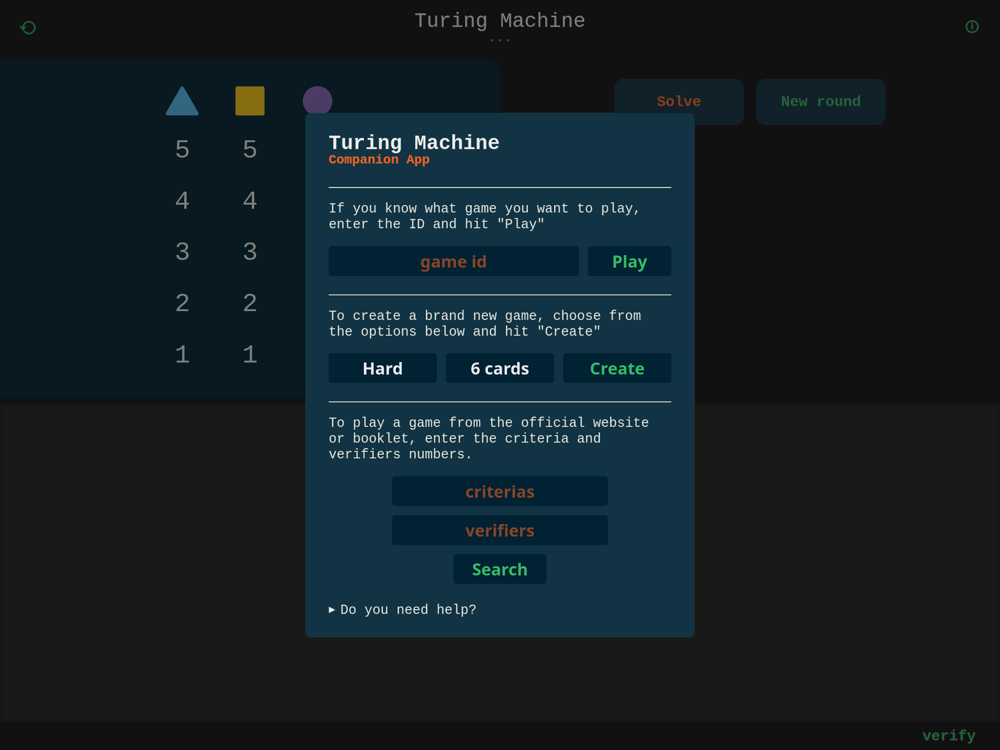

# Turing Machine Companion

This repository aims to provide a companion for the
"[Turing Machine](https://www.scorpionmasque.com/en/turingmachine)"
board game by [Scorpion Masque](https://www.scorpionmasque.com).

Scorpion Masque makes quite a few fun unique board games, personally I would
suggest also checking out [Decrypto](https://www.scorpionmasque.com/en/decrypto)
and [Sky Team](https://www.scorpionmasque.com/en/sky-team).

Over the holidays I was gifted Turing Machine which my partner and I had a lot
of fun playing together; furthermore, the game code generation and constraints
system intrigued me as I was looking for some fun side coding project. One thing
lead to another and here we are: this is a Go implementation for a turing machine
game solver/generator/api with a web UI component.

## Performance

The components of the main library (`./src/game`) have been profiled and optimized
to ensure very high speed and efficiency in solving/generating games.

The games generation went from taking almost an hour to generate/sort/save
all 20M possible game combinations to now taking under 5 seconds (on my laptop).

Some of the optimizations used to speed things up are:
- During game generation, make use of all available CPU cores (and merge-sort solutions)
- During game generation, skip over known invalid solutions (ex: see `State.AddValidChoice()` and `State.NextValidChoice(...)`)
- Use bit-masks to speedup computations (ex: see `CodeMask`)
- Whenever possible, precompute answers to common calculations (ex: see `newLaw(...)` handling of `Law.Mask`)
- Whenever possible, replace maps with arrays (see `../criteria.go`)
- Use a buffer to write games to disk efficiently (see `../solver.go`).
- Individual function optimizations based on CPU profile analysis.

## How to

No instructions are provided. This is a companion for an existing game, you need
to purchase and play though the game to begin to understand how this works.
Once you get a hang of the physical game you can try to figure out how to play
the game using this companion software.

## License

Although the code in this repository is distributed under a MIT license, the game
as well as some of the assets (intentionally excluded from this repository) are
property of "Le Scorpion Masque Inc".

## Helpful Resources

Here are some helpful resources that helped me develop this library:
- [turingmachine.info](https://turingmachine.info/): the official site, full of sample problems
- [zyle87/turing-machine-interactive-sheet](https://github.com/zyle87/turing-machine-interactive-sheet): this project help me think about how to port the game UX to the web
- [ThomasdenH/turing-machine-ai](https://github.com/ThomasdenH/turing-machine-ai): a solver for the game implemented in rust
- [alexander-zibert/turing-machine-board-game-solver](https://github.com/alexander-zibert/turing-machine-board-game-solver): a solver written in c++